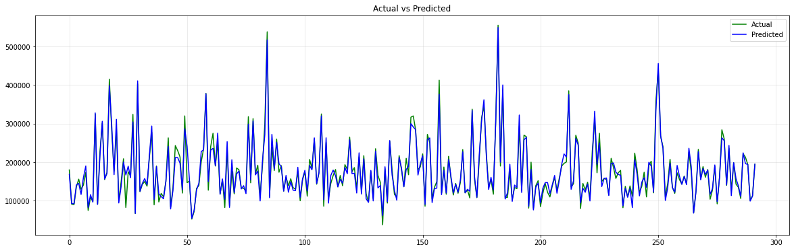

## Семинарска работа по вовед во науката за податоци

https://www.kaggle.com/c/house-prices-advanced-regression-techniques

#### Работеле: Ана Георгиеска, Васко Божиновски, Ѓорѓи Димески

 На овој проект работевме со податоци за куќи во Амес, град во Ајова, САД. Податоците вклучуваат 79 променливи кои ги опишуваат повеќето аспекти на домовите. Целта на натпреварот на kaggle е да се предвиди цената на куќите. Метриката која се користи при оценување на предвидените резултати е коренот на средната квадратна грешка. Затоа, при евалуација на моделите ја користеме таа метрика.

 Најмал корен на средната квадратна грешка добивме со моделот XGBRegressor со параметри: max_depth=3, learning_rate=0.1, n_estimators=1000, colsample_bytree=0.5; таа изнесуваше: 24001.497962. Со овој модел на Kaggle го освоивме 1072 место. Најдобар модел на Kaggle се покажа LGBMRegressor со параметри: max_depth=4, learning_rate=0.01, n_estimators=2560; постигнавме резултат 0.13092 и бевме рангирани 1044-ти. Користејќи невронски мрежи добивме најмал корен на квадратна средна грешка од ~24600, а како резултат на Kaggle добивме 0.14720 и 2231 место.

 #### Вистински и предвидени цени на куќи од LGBMRegressor

 

